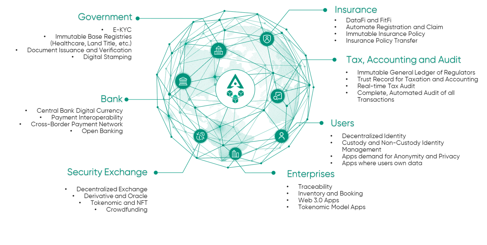

# CamDL (Cambodia Distributed Ledger)

CamDL is a blockchain network aiming to provide the public a platform for building
and experimenting with blockchain technology to solve their everyday challenges
within the community or the industry. CamDL is powered by Hyperledger Besu®, an
open source Ethereum client developed under Apache 2.0 license written in Java.<a href="https://camdl.gov.kh" target="_blank"> Click to learn more</a>

CamDL works toward creating the best open blockchain infrastructure, retaining a
focus on bringing health and wealth into the recently growing global blockchain
superstructure as we reach out to all network users both locally and worldwide.

<figure markdown>
  
  <figcaption>CamDL Potential Use Cases</figcaption>
</figure>
