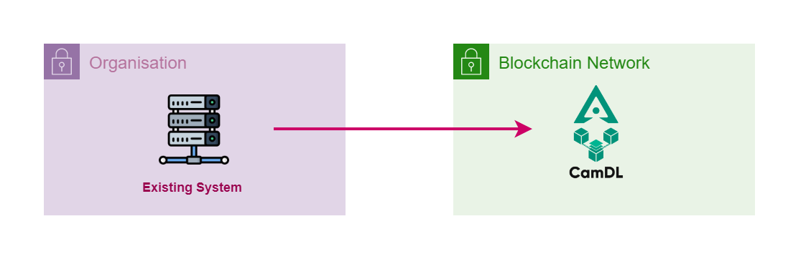

# Smart Contract (Coming Soon)
Developer could interact directly with smart contract hosted on CamDL network without the need to connect to Digital Signature platform. This further increase trusts with the platform yet still can get full functionality offers by the platform. This requires developer who has deeper knowledge with interaction to the blockchain network and maintaining CamDL compute credit to make sure the trasaction is successfully mined by the network

<figure markdown>
  { width="510"}
  <figcaption>Smart Contract Integration Flow</figcaption>
</figure>