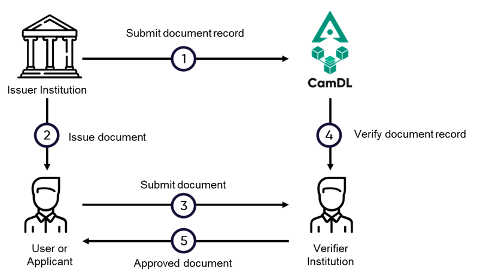

# Introduction

Digital Signature Platform is a platform for companies or government organizations to certify or verify any digital contents by the use of blockchain technology. 

<figure markdown>
  { width="510"}
  <figcaption>Document Issuance and Verification Process</figcaption>
</figure>

This platform is built remove the complexity of integrating information system directly to the blockchain itself and replace it with a simple to integrate service yet feature rich web API. The platform allows those organisation to performs digital content (files, digital payload or transactions) issuances at the same time enable the verification process to identifies issuers and approver of those contents without exposing content of those digital file or transactions to third party. 

## Privacy
By the use of hashing algoritm, organisation could issue any digital content on the platform without the need of exposing the whole file itself to the public through the nature of one way function of hashing algorithm. 
<figure markdown>
  { width="510"}
  <a href="https://www.okta.com/identity-101/hashing-algorithms/" target="_blank">Hashing Algorithm Overview: Types, Methodologies & Usage
  </a>
</figure>

<!-- 

- :fontawesome-brands-html5: __HTML__ for content and structure
- :fontawesome-brands-js: __JavaScript__ for interactivity
- :fontawesome-brands-css3: __CSS__ for text running out of boxes
- :fontawesome-brands-internet-explorer: __Internet Explorer__ ... huh?

## Commands

* `mkdocs new [dir-name]` - Create a new project.
* `mkdocs serve` - Start the live-reloading docs server.
* `mkdocs build` - Build the documentation site.
* `mkdocs -h` - Print help message and exit.

## Project layout

    mkdocs.yml    # The configuration file.
    docs/
        index.md  # The documentation homepage.
        ...       # Other markdown pages, images and other files. -->
