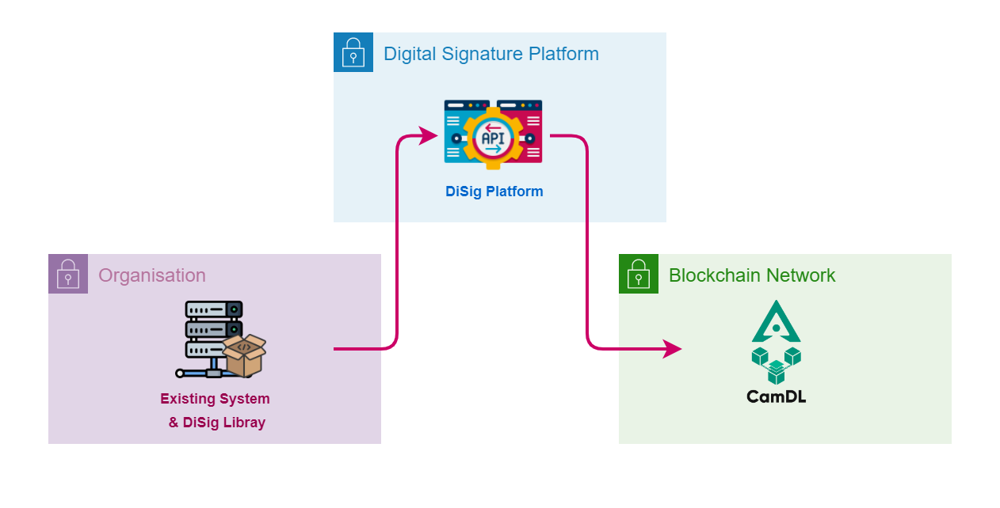

# SDK

Platform offer various SDKs for different programming languages for developer to integrate with their application to facilitate the integration with digital signature platform. Developer can use the provided SDK to interact with digital signature with the provided code example from our documentation.

<figure markdown>
  { width="510"}
  <figcaption>SDK Integration Flow</figcaption>
</figure>